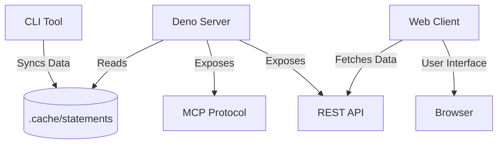

# Financial Coach MCP

A personal finance ecosystem combining a CLI for data synchronization, a Deno-based Server (supporting the Model Context Protocol), and a modern Web Client dashboard.

## Overview

Financial Coach MCP is designed to help you track your finances by synchronizing bank transactions via Open Banking (GoCardless) and presenting them in a unified dashboard. Beyond a standard UI, it exposes an **MCP (Model Context Protocol)** server, allowing AI assistants (like Claude) to securely access and analyze your financial data to provide personalized coaching.

## Architecture

The project consists of three main components that interact with a shared data layer:



1.  **CLI (`/cli`)**: Connects to Open Banking providers to fetch transactions and balances, normalizing them into monthly JSON statements stored in `.cache/`.
2.  **Server (`/server`)**: A Deno + Hono server that:
    *   Serves the JSON/CSV statements via a REST API.
    *   Hosts the MCP endpoint for AI integration.
3.  **Web Client (`/web-client`)**: A Vite + Lit application that visualizes the monthly statements.

## Getting Started

### Prerequisites

*   **Deno**: Ensure Deno is installed (v2.0+ recommended).
*   **GoCardless Account**: You need a Secret ID and Key from GoCardless to access Open Banking APIs.

### Configuration

Create a configuration environment (e.g., in your shell profile or `.env` equivalent). The CLI and Server require the following environment variables:

| Variable | Description | Example |
| :--- | :--- | :--- |
| `APP_ENV` | Environment mode (`DEV` or `PROD`). | `DEV` |
| `GO_CARD_LESS_SECRET_ID` | Your GoCardless Secret ID. | `your_secret_id` |
| `GO_CARD_LESS_SECRET_KEY` | Your GoCardless Secret Key. | `your_secret_key` |
| `APP_OPENBANKING_HOST` | Host for redirects (PROD only). | `financial-coach.com` |

### Installation

No explicit install step is needed beyond having Deno. The dependencies are managed via `deno.json` workspaces.

### Quick Start

1.  **Sync Data**: Fetch your latest bank data.
    ```bash
    # Sync for a specific month (Format: YYYYMmm)
    deno run -A cli/sync.ts 2026M01
    ```

2.  **Start the System**: Launch both the Server and Web Client.
    ```bash
    deno task start
    ```
    *   **Server**: Runs on `http://localhost:8084`
    *   **Web Client**: Runs on `http://localhost:8080`

## Component Details

### CLI (`/cli`)

The CLI is the entry point for data ingestion. It handles the complexity of OAuth flows and token management with Open Banking providers.

*   **Key Command**: `deno run -A cli/sync.ts [YearMonthCode]`
*   **Output**: Saves standardized JSON statements to `.cache/statements/`.

### Server (`/server`)

The backend engine powered by **Hono**.

*   **Port**: `8084`
*   **Endpoints**:
    *   `/mcp`: Model Context Protocol entry point.
    *   `/statements/:yearMonthCode.json`: Get raw statement data.
    *   `/statements/:yearMonthCode.csv`: Download statement as CSV.
*   **MCP Integration**: Configure your AI client (e.g., Claude Desktop) to point to this server to enable queries like "How much did I spend on groceries last month?".

### Web Client (`/web-client`)

A reactive frontend built with **Vite**, **Lit**, and **WebAwesome**.

*   **Port**: `8080` (Dev Server)
*   **Features**:
    *   Monthly statement visualization.
    *   Transaction categorization (via MCP analysis context).
    *   Responsive data tables.
*   **Configuration**: Adjust `web-client/src/config.ts` if your API server runs on a different port.

## Contributing

1.  **Workspace**: This is a Deno workspace. Run tests across all modules:
    ```bash
    deno test
    ```
2.  **Linting**:
    ```bash
    deno lint
    ```
3.  **Formatting**:
    ```bash
    deno fmt
    ```

## License

MIT