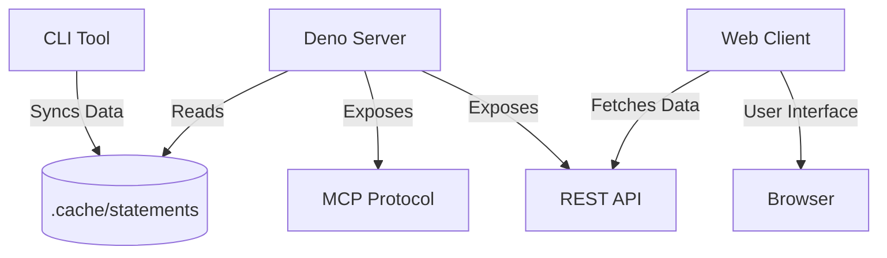

# Financial Coach MCP

A personal finance ecosystem combining a CLI for data synchronization, a
Deno-based Server (supporting the Model Context Protocol), and a modern Web
Client dashboard.

## Overview

Financial Coach MCP is designed to help you track your finances by synchronizing
bank transactions via Open Banking (GoCardless) and presenting them in a unified
dashboard. Beyond a standard UI, it exposes an **MCP (Model Context Protocol)**
server, allowing AI assistants (like Claude) to securely access and analyze your
financial data to provide personalized coaching.

## Architecture

The project consists of three main components that interact with a shared data
layer:


```mermaid
graph TD
    CLI[CLI Tool] -- Syncs Data --> Cache[(.cache/statements)]
    Server[Deno Server] -- Reads --> Cache
    Server -- Exposes --> MCP[MCP Protocol]
    Server -- Exposes --> API[REST API]
    Web[Web Client] -- Fetches Data --> API
    Web -- User Interface --> Browser
```

1. **CLI (`/cli`)**: Connects to Open Banking providers to fetch transactions
   and balances, normalizing them into monthly JSON statements stored in
   `.cache/`.
2. **Server (`/server`)**: A Deno + Hono server that:
   - Serves the JSON/CSV statements via a REST API.
   - Hosts the MCP endpoint for AI integration.
3. **Web Client (`/web-client`)**: A Vite + Lit application that visualizes the
   monthly statements.

## Getting Started

### Prerequisites

- **Deno**: Ensure Deno is installed (v2.0+ recommended).
- **Google Cloud CLI (`gcloud`)**: Required by `./scripts/sync.sh` to retrieve
  GoCardless credentials (`gocardless-secret-id` and `gocardless-secret-key`)
  from GCP Secret Manager.
- **Cloudflare CLI (`cloudflared`)**: Required by `./scripts/sync.sh` to create
  a temporary HTTPS tunnel for Open Banking OAuth redirect callbacks.
- **Antigravity CLI (`agy`)**: Required during sync to run automated AI
  financial analysis on synchronized statements.
- **rclone**: Required for Google Drive backups. Ensure you have a remote named
  `gdrive` configured.
- **GoCardless Account**: Required to access Open Banking APIs.

### Configuration

The CLI and Server rely on environment variables, which are automatically
fetched or configured during operation:

| Variable                       | Description                                 | Example / Default                                          |
| :----------------------------- | :------------------------------------------ | :--------------------------------------------------------- |
| `APP_ENV`                      | Environment mode (`DEV` or `PROD`).         | `DEV`                                                      |
| `GO_CARD_LESS_SECRET_ID`       | GoCardless Secret ID.                       | Auto-fetched from GCP Secret Manager via `gcloud`          |
| `GO_CARD_LESS_SECRET_KEY`      | GoCardless Secret Key.                      | Auto-fetched from GCP Secret Manager via `gcloud`          |
| `APP_OPENBANKING_REDIRECT_URL` | Redirect URL for Open Banking callbacks.    | Auto-generated HTTPS URL via `cloudflared` tunnel in `DEV` |
| `VITE_API_BASE_URL`            | Base API host for the Web Client dashboard. | Defaults to `http://localhost:8084`                        |

### Installation

No explicit install step is needed beyond having Deno and the required CLI tools
(`gcloud`, `cloudflared`, `agy`, `rclone`). Project dependencies are managed via
`deno.json` workspaces.

### Quick Start

1. **Sync Data**: Fetch your latest bank data, analyze statements with AI, and
   back up to Google Drive.
   ```bash
   # Sync for a specific month (Format: YYYYMmm)
   bash ./scripts/sync.sh 2026M01
   ```
   _Note: Ensure `gcloud` is logged in and `cloudflared` is installed before
   running sync._

2. **Start the System**: Launch both the Server and Web Client simultaneously
   using the unified orchestrator script.
   ```bash
   bash ./scripts/start.sh
   ```
   - **Server**: Runs on `http://localhost:8084`
   - **Web Client**: Runs on Vite dev server (configured with
     `VITE_API_BASE_URL`)
   - **CLI (Open Banking Callback)**: Binds to port `8083` (tunneled dynamically
     via `cloudflared`)

## Component Details

### CLI (`/cli`)

The CLI is the entry point for data ingestion. It handles the complexity of
OAuth flows and token management with Open Banking providers.

- **Prerequisites**: `gcloud` (fetches secrets), `cloudflared` (creates OAuth
  callback tunnel), `agy` (runs AI analysis), and `rclone` (Google Drive
  backup).
- **Key Command**: `./scripts/sync.sh [YearMonthCode]`
- **Port**: `8083` (Used as the temporary callback port for Open Banking OAuth,
  exposed via `cloudflared`)
- **Output**: Saves standardized JSON statements to `.cache/statements/` and
  copies them to Google Drive (`gdrive:` remote).

### Server (`/server`)

The backend engine powered by **Hono** on Deno.

- **Port**: `8084`
- **Endpoints**:
  - `/mcp`: Model Context Protocol entry point.
  - `/statements/:yearMonthCode.json`: Get raw statement data.
  - `/statements/:yearMonthCode.csv`: Download statement as CSV.
- **MCP Integration**: Point your AI assistant (e.g., Claude Desktop,
  Antigravity) to this server to analyze transaction data.

### Web Client (`/web-client`)

A reactive frontend built with **Vite**, **Lit**, and **WebAwesome**.

- **Features**:
  - Monthly statement visualization.
  - Transaction categorization and financial insights.
  - Responsive data tables.
- **Runner**: Started concurrently alongside the server via
  `bash ./scripts/start.sh` (or `deno task -f @app/web-client start`).

## Contributing

1. **Workspace**: This is a Deno workspace. Run tests across all modules:
   ```bash
   deno test
   ```
2. **Linting**:
   ```bash
   deno lint
   ```
3. **Formatting**:
   ```bash
   deno fmt
   ```

## License

MIT
